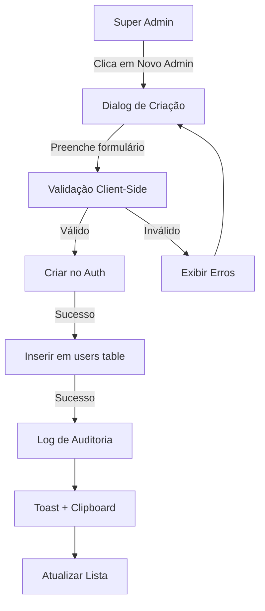

# 📋 Tipos de Conta - Documentação Completa

## 🎯 Visão Geral do Sistema de Roles

O sistema possui **5 tipos de conta** com permissões e acessos específicos:

---

## 1. 👑 SUPER ADMINISTRADOR (`super_admin`)

### Identificação Visual
- **Badge**: Amarelo/Dourado
- **Ícone**: 👑 Crown
- **Cores**: `bg-yellow-100 text-yellow-800 border-yellow-300`

### Permissões
✅ **ACESSO TOTAL** a todas as funcionalidades
- Criar/editar/deletar TODOS os tipos de usuários
- Acessar painel de auditoria
- Gerenciar configurações do sistema
- Acesso a segurança e logs
- Todas as permissões de Admin + Marketing + Financeiro

### Casos de Uso
- Proprietários/Fundadores da EXA
- CTO/CEO
- Responsáveis pela infraestrutura

---

## 2. 🛡️ ADMINISTRADOR GERAL (`admin`)

### Identificação Visual
- **Badge**: Azul
- **Ícone**: 🛡️ Shield
- **Cores**: `bg-blue-100 text-blue-800 border-blue-300`

### Permissões
✅ Gestão completa de:
- Prédios e localização
- Painéis e dispositivos
- Pedidos e vendas
- Vídeos e conteúdo
- Benefícios de prestadores
- Relatórios financeiros
- Aprovações

❌ NÃO pode:
- Criar outros usuários administrativos
- Acessar configurações do sistema
- Gerenciar configuração de homepage

### Casos de Uso
- Gerente de Operações
- Coordenador Comercial
- Gerente de Projetos

---

## 3. 🎨 ADMINISTRADOR MARKETING (`admin_marketing`)

### Identificação Visual
- **Badge**: Roxo
- **Ícone**: ✓ UserCheck
- **Cores**: `bg-purple-100 text-purple-800 border-purple-300`

### Permissões
✅ Gestão de:
- **Leads** (Síndicos, Produtora, Linkae, EXA)
- **Campanhas de marketing**
- **Vídeos** (aprovar/rejeitar)
- **Portfólio da produtora**
- **Configuração da homepage**
- **Logos e conteúdo visual**
- **Notificações**

❌ NÃO pode:
- Acessar dados financeiros
- Ver pedidos/vendas
- Gerenciar prédios/painéis
- Criar usuários

### Casos de Uso
- Gerente de Marketing
- Social Media
- Gestor de Conteúdo
- Designer

---

## 4. 💰 ADMINISTRADOR FINANCEIRO (`admin_financeiro`)

### Identificação Visual
- **Badge**: Verde Esmeralda
- **Ícone**: 💰 DollarSign
- **Cores**: `bg-emerald-100 text-emerald-800 border-emerald-300`

### Permissões
✅ Acesso TOTAL a:
- **Todos os Pedidos/Vendas**
- **Benefícios de Prestadores**
- **Relatórios Financeiros**
- **Dashboard Financeiro**
- **Exportação de dados financeiros**

✅ Pode:
- Visualizar detalhes de pagamentos
- Gerenciar códigos de gift cards
- Ver histórico de transações
- Gerar relatórios personalizados

❌ NÃO pode:
- Gerenciar prédios/painéis
- Acessar leads
- Criar usuários
- Aprovar vídeos
- Gerenciar campanhas

### ⚠️ IMPORTANTE: Sistema de Auditoria
**TODAS as ações são registradas automaticamente:**
- Visualizações de pedidos
- Exportações de dados
- Criação/edição de benefícios
- Acessos a relatórios

**Super Admin pode auditar:**
- Ver TODAS as ações do Financeiro
- Filtrar por período
- Exportar logs de auditoria

### Casos de Uso
- Controller Financeiro
- Gerente Financeiro
- Contador
- Analista de Contas

---

## 5. 👤 CLIENTE (`client`)

### Identificação Visual
- **Badge**: Cinza
- **Ícone**: ✓ UserCheck
- **Cores**: `bg-gray-100 text-gray-800 border-gray-300`

### Permissões
✅ Acesso a:
- Seus próprios vídeos
- Suas campanhas
- Seu perfil
- Pedidos próprios

❌ Sem acesso administrativo

### Casos de Uso
- Clientes finais da plataforma
- Anunciantes

---

## 🎨 Tabela de Cores e Ícones

| Role | Ícone | Cor Principal | Hex | HSL |
|------|-------|---------------|-----|-----|
| super_admin | 👑 Crown | Amarelo | `#FDE047` | `hsl(54, 98%, 64%)` |
| admin | 🛡️ Shield | Azul | `#60A5FA` | `hsl(213, 94%, 68%)` |
| admin_marketing | ✓ UserCheck | Roxo | `#C084FC` | `hsl(271, 91%, 76%)` |
| admin_financeiro | 💰 DollarSign | Verde | `#34D399` | `hsl(158, 64%, 52%)` |
| client | ✓ UserCheck | Cinza | `#9CA3AF` | `hsl(220, 9%, 65%)` |

---

## 📝 Campos na Criação de Usuários

### Campos Obrigatórios
- ✅ **Nome** (2-100 caracteres)
- ✅ **Sobrenome** (2-100 caracteres)
- ✅ **Email** (validação de formato)
- ✅ **Tipo de Conta** (role)

### Campos Opcionais
- 📄 **CPF/Documento** (pode ser tornado obrigatório por Super Admin)
  - Formatação automática: XXX.XXX.XXX-XX
  - Validação de formato
  - Switch "Tornar obrigatório"

### Senha Padrão
```
indexa2025
```
- Enviada automaticamente
- Deve ser alterada no primeiro acesso
- Copiada para clipboard na criação

---

## 🔄 Fluxo de Criação



---

## 🔐 Segurança

### RLS Policies
Todas as tabelas têm Row-Level Security:
```sql
-- Exemplo: pedidos
CREATE POLICY "Admins financeiros podem ver pedidos"
ON pedidos FOR SELECT
TO authenticated
USING (
  has_role(auth.uid(), 'admin_financeiro'::app_role) OR
  has_role(auth.uid(), 'admin'::app_role) OR
  has_role(auth.uid(), 'super_admin'::app_role)
);
```

### Validação de Entrada
- ✅ Schema Zod para validação
- ✅ Sanitização de strings (trim)
- ✅ Regex para CPF
- ✅ Limites de caracteres
- ✅ Prevenção de XSS

### Auditoria
- ✅ Hook `useActivityLogger`
- ✅ Registro automático de ações
- ✅ Metadata completa
- ✅ IP e User Agent (quando disponível)

---

## 🚨 Troubleshooting

### Problema: Role não aparece corretamente
**Causa**: Badge não atualizado em todos os componentes
**Solução**: Verificar `getRoleBadge()` em:
- `EnhancedUserMobileCard.tsx`
- `UserDetailsCard.tsx`
- `IndexaTeamSection.tsx`
- `UserManagementPanel.tsx`
- `UserDetailsDialog.tsx`
- `UserMobileCard.tsx`

### Problema: Usuário criado com role errado
**Causa**: Estado do formulário não sincronizado
**Solução**: 
1. Verificar `useState` inicial
2. Confirmar que `onValueChange` está correto
3. Verificar console logs na criação

### Problema: CPF não salva
**Causa**: Campo não está sendo enviado
**Solução**:
```typescript
const cpfLimpo = cpf.replace(/\D/g, ''); // Remove formatação
if (cpfLimpo) {
  userData.cpf = cpfLimpo;
  userData.tipo_documento = 'cpf';
}
```

---

## 📊 Componentes Envolvidos

### Criação
- `CreateUserDialog.tsx` - Dialog principal
- Schema Zod para validação
- Formatação automática de CPF

### Visualização
- `EnhancedUserMobileCard.tsx` - Card mobile
- `UserDetailsCard.tsx` - Dialog de detalhes
- `UserStatsCards.tsx` - Estatísticas

### Listagem
- `UsersPage.tsx` - Página principal
- `IndexaTeamSection.tsx` - Desktop view
- Filtros e busca

### Auditoria
- `AuditPage.tsx` - Super Admin only
- `AuditLogTable.tsx` - Tabela de logs
- `useActivityLogger.tsx` - Hook

---

## 🎯 Boas Práticas

1. **Sempre validar entrada do usuário**
2. **Usar badges consistentes em todos os componentes**
3. **Registrar ações críticas no log de auditoria**
4. **Incluir ícone DollarSign para admin_financeiro**
5. **Manter cores e estilos padronizados**
6. **Testar criação de cada tipo de conta**
7. **Verificar permissões no banco de dados**

---

## 📞 Suporte

Para problemas relacionados a tipos de conta:
1. Verificar badge visual está correto
2. Confirmar role no banco de dados
3. Testar permissões de acesso
4. Consultar logs de auditoria
5. Verificar RLS policies

---

**Última atualização**: 08/11/2025
**Versão**: 2.0
